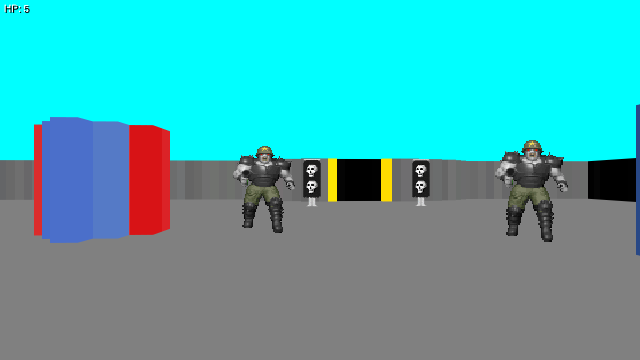

# Doomed

Doomed is a very basic not-quite-3D game using
[raycasting](https://en.wikipedia.org/wiki/Ray_casting#Ray_casting_in_early_computer_games)
(without texture mapping) for its rendering.

You can play it here: https://s.mort.coffee/doomed

## Running the game

There is no build step involved, just start an HTTP server
(for example using `python3 -m http.server`)
from within this repository.
